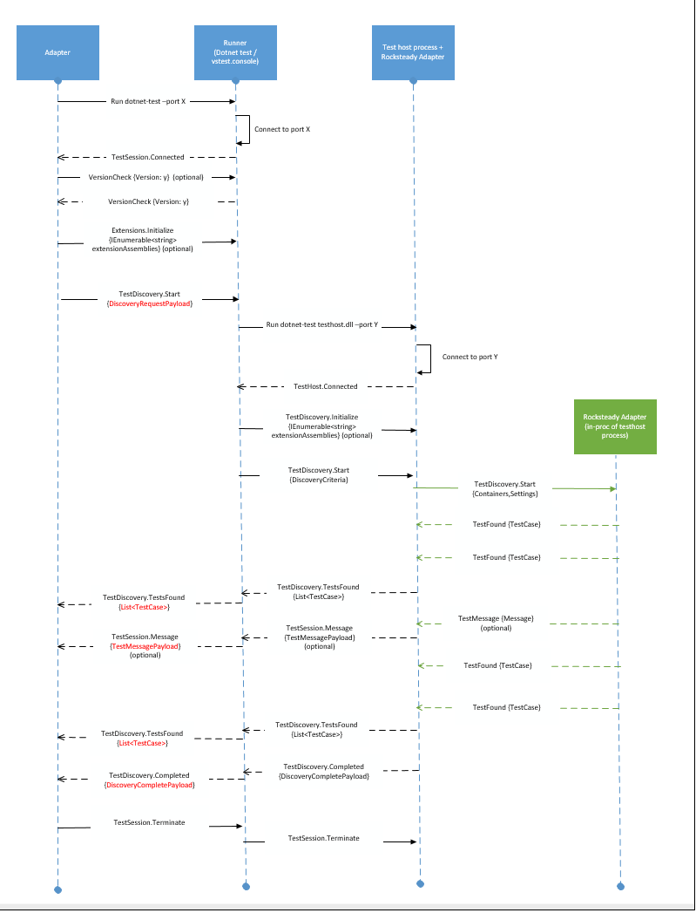

# 0002 Test Discovery Protocol

## Summary
This note details the protocol improvements in the new dotnet-test integration with IDE's. The focus will be more on the delta with the older protocol and the breaking changes.

## Motivation
These protocol changes provides the following improvements to dotnet-test:
* Ability to accept multiple containers
* Consistent experience with the capabilities that vstest.console provides - Rocksteady adapter and Logger extensibility.

## Detailed Design

### Terminology
* **IDE adapter (existing dotnet-test)** : Component that listens to messages from dotnet-test and populates the IDE with tests discovered or test results. For VS IDE this is the projectK Adapter.
* **TestRunner**: The test framework specific runner that discovers/executes tests in a container for that framework. This is dotnet-test-mstest / dotnet-test-xunit / dotnet-test-nunit.
* **Dotnet-test/vstest.console(Runner)**: Orchestrator of discovery or execution operations with one or more test host processes which then communicates back to the adapter the test cases or test results received from the test host process. This component also hosts the logger functionality which logs the test results in a file or posts them to a server.
* **Test host process**: The host process that loads the rocksteady engine which then calls into the Rocksteady adapters to discover/execute tests. This component communicates back to the client (dotnet-test or vstest.console.exe) with set of tests discovered or test results.
* **Rocksteady adapter**: The framework specific adapter that discovers or executes tests of that framework. These adapters are invoked in-proc by the rocksteady engine via the ITestDiscoverer and ITestExecutor interfaces.
* **TP V2**: The new cross-plat test platform which encompasses the Runner, test host and the adapters. This is the framework that enables users to run tests.

### Protocol
This is the existing dotnet-test integration with IDEs:

Reference: https://github.com/dotnet/cli/blob/rel/1.0.0/Documentation/dotnet-test-protocol.md

Here is what the changed wire protocol looks like after TPV2 integrates with dotnet-test:

### Breaking changes for Adapter(IDE)
1. The object model used via the wire protocol will change from using [Microsoft.Extensions.Testing.Abstractions.Test](https://github.com/dotnet/cli/blob/rel/1.0.0/src/Microsoft.Extensions.Testing.Abstractions/Test.cs) to [Microsoft.VisualStudio.TestPlatform.ObjectModel.TestCase](https://github.com/Microsoft/vstest/blob/master/src/Microsoft.TestPlatform.ObjectModel/TestCase.cs). 
2. The IDE adapter would now be sending the test Containers along with test platform settings to dotnet-test.
3. The IDE adapter would now receive test cases in a batch as opposed to a single test case earlier to improve performance.
4. The IDE adapter would now receive a [DiscoveryCompletePayload](https://github.com/Microsoft/vstest/blob/master/src/Microsoft.TestPlatform.CommunicationUtilities/Messages/DiscoveryCompletePayload.cs) message with the TestDiscovery.Completed message. This would have the run stats and the last set of test cases found.

### Breaking Changes for Frameworks
1. TestRunner would cease to exist. Framework writers would have to port their Rocksteady adapters to Core CLR to support all .NET Core scenarios.

### New Flow
1. After the optional version check, the IDE adapter can choose to optionally send paths to extensions it wants to initialize the test platform with.
2. It then sends a TestDiscovery.Start message with a [DiscoveryRequestPayload](https://github.com/Microsoft/vstest/blob/master/src/Microsoft.TestPlatform.VsTestConsole.TranslationLayer/Payloads/DiscoveryRequestPayload.cs) which contains the sources and settings. Dotnet-test will start the test host process and pass on the containers and settings to it.
3. The testhost then invokes the rocksteady adapter with the containers to discover tests. It uses the ITestDiscoverer.DiscoverTests as its entry point to the Rocksteady Adapter.
4. The Rocksteady adapter then sends each test case discovered to the test host which caches this information.
5. The test host passes on the cached test cases to dotnet-test in batches when a cache size is hit which then forwards it over to the IDE adapter.
6. Optionally the IDE adapter may also receive a TestSession.Message with a [TestMessagePayload](https://github.com/Microsoft/vstest/blob/master/src/Microsoft.TestPlatform.CommunicationUtilities/Messages/TestMessagePayload.cs) notifying of any issues during discovery.
7. After all tests are discovered, the test host sends a TestDiscovery.Completed message with a [DiscoveryCompletePayload](https://github.com/Microsoft/vstest/blob/master/src/Microsoft.TestPlatform.CommunicationUtilities/Messages/DiscoveryCompletePayload.cs), which has the stats and the last set of test cases found, to dotnet-test. 
8. dotnet-test then sends a TestDiscovery.Completed with the [DiscoveryCompletePayload](https://github.com/Microsoft/vstest/blob/master/src/Microsoft.TestPlatform.CommunicationUtilities/Messages/DiscoveryCompletePayload.cs) to the IDE adapter.
9. Once the IDE adapter is done, it sends dotnet-test a TestSession.Terminate which will cause dotnet test to shutdown.

### Notes
1. Since TP V2 supports discovery on multiple containers with a bunch of settings the IDE adapter can now pass in the containers as a List<string> to dotnet-test. Dotnet-test would then orchestrate among (multiple) test host processes and update the Adapter with the tests found.
