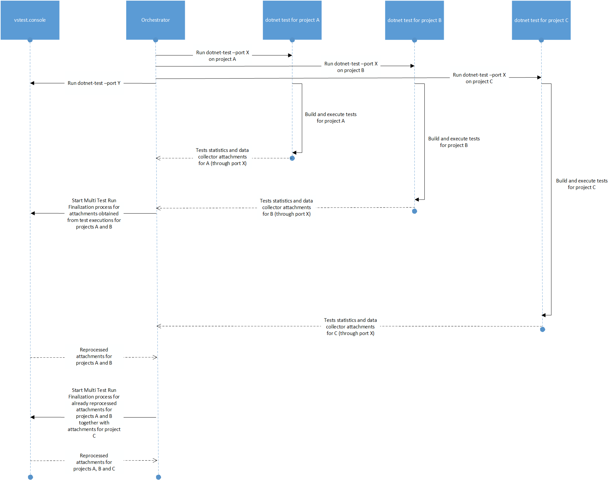

# 0031 Multi Test Run Finalization

# Summary
This document details a data collector extensibility point to reprocess (combine/merge) attachments obtained across test executions in both design mode and commandline scenarios.

# Motivation
Today when Test Platform executes tests in parallel only code coverage reports are merged (data collector attachments with uri: `datacollector://microsoft/CodeCoverage/2.0`). For other data collector attachments reprocessing is skipped and all of them are returned by Test Platform.

The [dotnet test](https://docs.microsoft.com/en-us/dotnet/core/tools/dotnet-test) command is used to execute unit tests in a given solution. The `dotnet test` command builds the solution and runs a test host application for each test project in the solution. However, currently there is no way to reporcess (combine/merge) data collector attachments associated with each project execution. Code coverage reports are not merged.

When `Run All Tests` is performed in VS, tests for projects can be executed separately based on target platform/target framework amongst other criteria. In this case also combining/merging of data collector attachments is not performed (e.g. code overage reports are not merged). `Analyze Code Coverage for All Tests` is showing coverage report for only some test projects in the run.

# Proposed Changes

Introduce a new `IDataCollectorAttachmentProcessor` interface which can be implemented by Test Platform extensions and provide custom logic to reporcess (combine/merge) data collector attachments. Below interface should be used only for providing logic to reprocess information from data collector attachments from independent test executions. In other words data collector attachment should be modified/created using data from other data collector attachments. This interface should **not be** used for modifying any single data collector attachment. Test Platform will invoke `ProcessAttachmentSetsAsync` only if at least 2 data collector attachments related to processor (through `GetExtensionUris`) are created by independent test executions.

```
namespace Microsoft.VisualStudio.TestPlatform.ObjectModel.DataCollection
{
    /// <summary>
    /// Interface for data collectors add-ins that choose to reprocess generated attachments
    /// </summary>
    public interface IDataCollectorAttachmentProcessor
    {
        /// <summary>
        /// Gets the attachments Uris, which are handled by processor
        /// </summary>
        IEnumerable<Uri> GetExtensionUris();

        /// <summary>
        /// Indicates whether attachment processor is supporting incremental processing of attachments
        /// </summary>
        bool SupportsIncrementalProcessing   { get; }

        /// <summary>
        /// Reprocess attachments generated by independent test executions
        /// </summary>
        /// <param name="attachments">Attachments to be processed</param>
        /// <param name="progressReporter">Progress reporter. Accepts integers from 0 to 100</param>
        /// <param name="logger">Message logger</param>
        /// <param name="cancellationToken">Cancellation token</param>
        /// <returns>Attachments after reprocessing</returns>
        Task<ICollection<AttachmentSet>> ProcessAttachmentSetsAsyncAsync(ICollection<AttachmentSet> attachments, IProgress<int> progressReporter, IMessageLogger logger, CancellationToken cancellationToken);
    }
}
```

Method `GetExtensionUris` should provide all Uris for data collector attachments which are handled by current processor. Test platform will provide to processor only data collector attachments with such Uris. Result of method `ProcessAttachmentSetsAsync` shouyld contain only data collector attachments with such Uris.

`SupportsIncrementalProcessing` should indicate if processor is supporting incremental processing of attachments. It means that `ProcessAttachmentSetsAsync` should be [associative](https://en.wikipedia.org/wiki/Associative_property).

If `SupportsIncrementalProcessing` is `True` Test Platform may try to speed up whole process by reprocessing data collector attachments as soon as possible when any two test executions are done. For example let's assume we have 5 test executions which are generating 5 data collector attachments: `a1`, `a2`, `a3`, `a4` and `a5`. Test platform could perform invocations:
* `var result1 = await ProcessAttachmentSetsAsync([a1, a2, a3], ...);` when first 3 executions are done
* `var result2 = await ProcessAttachmentSetsAsync(result1.Concat([a4]), ...);` when 4th execution is done
* `var finalResult = await ProcessAttachmentSetsAsync(result2.Concat([a5]), ...);` when last test execution is done

If `SupportsIncrementalProcessing` is `False` then Test Platform will wait for all test executions to finish and call `ProcessAttachmentSetsAsync` only once:
* `var finalResult = await ProcessAttachmentSetsAsync([a1, a2, a3, a4, a5], ...);`

By default `SupportsIncrementalProcessing` should be `False`, unless processing can take longer time and it's beneficial to start the process as soon as possible.


2. Introduce a new `FinalizeMultiTestRunAsync` method in [IVsTestConsoleWrapper](https://github.com/microsoft/vstest/blob/master/src/Microsoft.TestPlatform.VsTestConsole.TranslationLayer/Interfaces/IVsTestConsoleWrapper.cs) interface:

```
/// <summary>
/// Provides back all attachments to TestPlatform for additional processing (for example merging)
/// </summary>
/// <param name="attachments">Collection of attachments</param>
/// <param name="multiTestRunCompleted">Indicates that all test executions are done and all data is provided</param>
/// <param name="collectMetrics">Enables metrics collection (used for telemetry)</param>
/// <param name="multiTestRunFinalizationCompleteEventsHandler">EventHandler to receive session complete event</param>
/// <param name="cancellationToken">Cancellation token</param>        
Task FinalizeMultiTestRunAsync(IEnumerable<AttachmentSet> attachments, bool multiTestRunCompleted, bool collectMetrics, IMultiTestRunFinalizationEventsHandler eventsHandler, CancellationToken cancellationToken);
```

Method can be used to start a new Multi Test Run Finalization process, which is reprocessing all data collector attachments passed as first argument using all available processors.


3. Introduce a new `IMultiTestRunFinalizationEventsHandler` interface:
```
namespace Microsoft.VisualStudio.TestPlatform.ObjectModel.Client
{
    /// <summary>
    /// Interface contract for handling multi test run finalization complete events
    /// </summary>
    public interface IMultiTestRunFinalizationEventsHandler : ITestMessageEventHandler
    {
        /// <summary>
        /// Dispatch MultiTestRunFinalizationComplete event to listeners.
        /// </summary>
        /// <param name="finalizationCompleteEventArgs">Finalization Complete event args.</param>
        /// <param name="attachments">Last set of processed attachment sets.</param>
        void HandleMultiTestRunFinalizationComplete(MultiTestRunFinalizationCompleteEventArgs finalizationCompleteEventArgs, IEnumerable<AttachmentSet> lastChunk);

        /// <summary>
        /// Dispatch FinalisedAttachments event to listeners.
        /// </summary>
        /// <param name="attachments">Finalised attachment sets.</param>
        void HandleFinalisedAttachments(IEnumerable<AttachmentSet> attachments);

        /// <summary>
        /// Dispatch MultiTestRunFinalizationProgress event to listeners.
        /// </summary>
        /// <param name="finalizationProgressEventArgs">Finalization Progress event args.</param>
        void HandleMultiTestRunFinalizationProgress(MultiTestRunFinalizationProgressEventArgs finalizationProgressEventArgs);
    }
}
```
Interface provides callbacks from Multi Test Run Finalization process. For every such process `HandleMultiTestRunFinalizationComplete` will be called once and will provide last chunk or all data collector attachments. During finalization process `HandleFinalisedAttachments` can be invoked several times providing data collector attachments that are already processed. Method `HandleMultiTestRunFinalizationProgress` will be invoked every time when `progressReporter` is used by `IDataCollectorAttachmentProcessor` implementation and will provide information about current collector: progress, uris and index of collector. Additionally event will contain also number of processors.


4. Use above logic to reprocess data collector attachments for parallel test executions and VS scenarios (e.g. `Run All Tests`, `Analyze Code Coverage for All Tests`). In case of `Analyze Code Coverage for All Tests` VS will use `vstest.console` in a variation of design mode and merge all code coverage reports. VS will show full code coverage report for all test projects.

5. When [dotnet test](https://docs.microsoft.com/en-us/dotnet/core/tools/dotnet-test) command is used to execute unit tests in a given solution, new console app `Orchestrator` will be executed.
  * `Orchestrator` for every project inside solution will start `dotnet test` command, using `Process` with output redirected. Output for every project will be printed to stdout with some mutex to not mix output from children. 
  * Additionally new test platform extension will be introduced and will propagate data about:
    - Attachments
    - Test results statistics
  back to `Orchestrator`.
  * In parallel with test executions `Orchestrator` will start `vstest.console` in Design Mode.
  * Whenever at least 2 test executions are finished `Orchestrator` will invoke `FinalizeMultiTestRunAsync` and provide all attachments from those test executions that finished. Parameter `multiTestRunCompleted` will be set to `false`. Test platform will provide data collector attachments only to processors which supports incremental processing.
  * When all test exections are done `Orchestrator` will provide all attachments back through `FinalizeMultiTestRunAsync` with `multiTestRunCompleted` set to `true`. Test Platform will use all available processors to process data collector attachments.
  * When all attachments are merged `Orchestrator` will display information about data collector attachments to standard output. 
  * Finally `Orchestator` will combine all tests results statistics and print it to standard output.



  For example let's assume we have .NET Core solution with 4 test projects `A1`, `A2`, `A3` and `A4`. Let's assume running tests for `A1`, `A2`, `A3`, `A4` takes 3, 4, 5 and 11 seconds respectively.
  Running `dotnet test` on solution level will result in:
  * Second 0: `Orchestrator` will run all tests projects in parallel (by invoking `dotnet test` for each project)
  * Second 0: `Orchestrator` starts `vstest.console` in Design Mode
  * Second 3: Tests for `A1` are completed. Code coverage report is produced. Let's name it `CC1`.
  * Second 4: Tests for `A2` are completed. Code coverage report is produced. Let's name it `CC2`. `Orchestator` starts merge of `CC1` and `CC2` by invoking `FinalizeMultiTestRunAsync([CC1, CC2], multiTestRunCompleted: false)`. Let's assume merging will take 3 seconds (will finish in second 8).
  * Second 5: Tests for `A3` are completed. Code coverage report is produced. Let's name it `CC3`. As merging is already in progress nothing is done.
  * Second 8: Merging of `CC1` and `CC2` is done. New Code coverage report is produced. Let's name it `CC1_2`. `Orchestator` starts merge of `CC1_2` and `CC3` by invoking `FinalizeMultiTestRunAsync([CC1_2, CC2], multiTestRunCompleted: false)`. Let's assume merging will take 2 seconds (will finish in second 10).
  * Second 10: Merging of `CC1_2` and `CC3` is done. New Code coverage report is produced. Let's name it `CC1_2_3`.
  * Second 11: Tests for `A4` are completed. Code coverage report is produced. Let's name it `CC4`. There is no merging in progress and all test executions are done. Orchestator` starts final merge of `CC1_2_3` and `CC4` by invoking `FinalizeMultiTestRunAsync([CC1_2_3, CC2], multiTestRunCompleted: true)`. Let's assume merging will take 2 seconds (will finish in second 13).
  * Second 13: Merging of `CC1_2_3` and `CC4` is done. New Code coverage report is produced. Let's name it `CC1_2_3_4`. `Orchestator` prints information about data attachment `CC1_2_3_4`. `Orchestator` prints aggregated statistics about tests from all `A1`, `A2`, `A3` and `A4`. 

# Additional classes

1. `MultiTestRunFinalizationCompleteEventArgs` used by IMultiTestRunFinalizationEventsHandler:

```
namespace Microsoft.VisualStudio.TestPlatform.ObjectModel.Client
{
    [DataContract]
    public class MultiTestRunFinalizationCompleteEventArgs : EventArgs
    {
        /// <summary>
        /// Default constructor.
        /// </summary>
        /// <param name="isCanceled">Specifies whether the finalization is canceled.</param>
        /// <param name="error">Specifies the error encountered during the execution of the finalization.</param>
        public MultiTestRunFinalizationCompleteEventArgs(bool isCanceled, Exception error)
        {
            this.IsCanceled = isCanceled;
            this.Error = error;
        }

        /// <summary>
        /// Gets a value indicating whether the finalization is canceled or not.
        /// </summary>
        [DataMember]
        public bool IsCanceled { get; private set; }

        /// <summary>
        /// Gets the error encountered during the finalization of the test runs. Null if there is no error.
        /// </summary>
        [DataMember]
        public Exception Error { get; private set; }

        /// <summary>
        /// Get or Sets the Metrics (used for telemetry)
        /// </summary>
        [DataMember]
        public IDictionary<string, object> Metrics { get; set; }
    }
}
```

2. `MultiTestRunFinalizationProgressEventArgs` used by IMultiTestRunFinalizationEventsHandler:

```
namespace Microsoft.VisualStudio.TestPlatform.ObjectModel.Client
{
    [DataContract]
    public class MultiTestRunFinalizationProgressEventArgs : EventArgs
    {
        /// <summary>
        /// Default constructor.
        /// </summary>
        /// <param name="currentProcessorIndex">Specifies current processor index.</param>
        /// <param name="currentProcessorUris">Specifies current processor Uris.</param>
        /// <param name="currentProcessorProgress">Specifies current processor progress.</param>
        /// <param name="processorsCount">Specifies the overall number of processors.</param>
        public MultiTestRunFinalizationProgressEventArgs(long currentProcessorIndex, ICollection<Uri> currentProcessorUris, long currentProcessorProgress, long processorsCount)
        {
            CurrentProcessorIndex = currentProcessorIndex;
            CurrentProcessorUris = currentProcessorUris;
            CurrentProcessorProgress = currentProcessorProgress;
            ProcessorsCount = processorsCount;
        }

        /// <summary>
        /// Gets a current processor index.
        /// </summary>
        [DataMember]
        public long CurrentProcessorIndex { get; private set; }

        /// <summary>
        /// Gets a current processor URI.
        /// </summary>
        [DataMember]
        public ICollection<Uri> CurrentProcessorUris { get; private set; }

        /// <summary>
        /// Gets a current processor progress.
        /// </summary>
        [DataMember]
        public long CurrentProcessorProgress { get; private set; }

        /// <summary>
        /// Gets the overall number of processors.
        /// </summary>
        [DataMember]
        public long ProcessorsCount { get; private set; }
    }
}
```