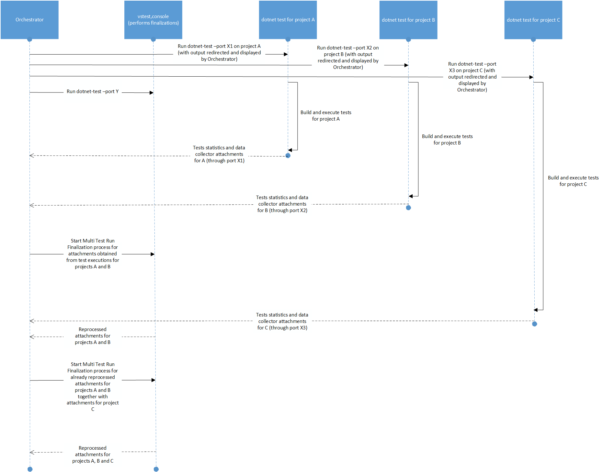

# 0031 Test Run Attachments Processing for dotnet test

# Summary
This document details a data collector extensibility point to reprocess (combine/merge) attachments obtained across test executions in commandline scenarios.

# Motivation

The [dotnet test](https://docs.microsoft.com/en-us/dotnet/core/tools/dotnet-test) command is used to execute unit tests in a given solution. The `dotnet test` command builds the solution and runs a test host application for each test project in the solution. However, currently there is no way to reporcess (combine/merge) data collector attachments associated with each project execution. Code coverage reports are not merged.

# Proposed Changes

1. When [dotnet test](https://docs.microsoft.com/en-us/dotnet/core/tools/dotnet-test) command is used to execute unit tests in a given solution, new console app `Orchestrator` will be executed.
  * `Orchestrator` for every project inside solution will start `dotnet test` command, using `Process` with output redirected. Output for every project will be printed to stdout with some mutex to not mix output from children. 
  * Additionally new test platform extension will be introduced and will propagate data about:
    - Attachments
    - Test results statistics
  back to `Orchestrator`.
  * In parallel with test executions `Orchestrator` will start `vstest.console` in Design Mode.
  * Whenever at least 2 test executions are finished `Orchestrator` will invoke `FinalizeMultiTestRunAsync` and provide all attachments from those test executions that finished. Parameter `multiTestRunCompleted` will be set to `false`. Test platform will provide data collector attachments only to attachments processors which supports incremental processing.
  * When all test exections are done `Orchestrator` will provide all attachments back through `FinalizeMultiTestRunAsync` with `multiTestRunCompleted` set to `true`. Test Platform will use all available attachment processors to process data collector attachments.
  * When all attachments are merged `Orchestrator` will display information about data collector attachments to standard output. 
  * Finally `Orchestator` will combine all tests results statistics and print it to standard output.

  For example let's assume we have .NET Core solution with 4 test projects `A1`, `A2`, `A3` and `A4`. Let's assume running tests for `A1`, `A2`, `A3`, `A4` takes 3, 4, 5 and 11 seconds respectively.
  Running `dotnet test` on solution level will result in:
  * Second 0: `Orchestrator` will run all tests projects in parallel (by invoking `dotnet test` for each project)
  * Second 0: `Orchestrator` starts `vstest.console` in Design Mode
  * Second 3: Tests for `A1` are completed. Code coverage report is produced. Let's name it `CC1`.
  * Second 4: Tests for `A2` are completed. Code coverage report is produced. Let's name it `CC2`. `Orchestator` starts merge of `CC1` and `CC2` by invoking `FinalizeMultiTestRunAsync([CC1, CC2], multiTestRunCompleted: false)`. Let's assume merging will take 3 seconds (will finish in second 8).
  * Second 5: Tests for `A3` are completed. Code coverage report is produced. Let's name it `CC3`. As merging is already in progress nothing is done.
  * Second 8: Merging of `CC1` and `CC2` is done. New Code coverage report is produced. Let's name it `CC1_2`. `Orchestator` starts merge of `CC1_2` and `CC3` by invoking `FinalizeMultiTestRunAsync([CC1_2, CC2], multiTestRunCompleted: false)`. Let's assume merging will take 2 seconds (will finish in second 10).
  * Second 10: Merging of `CC1_2` and `CC3` is done. New Code coverage report is produced. Let's name it `CC1_2_3`.
  * Second 11: Tests for `A4` are completed. Code coverage report is produced. Let's name it `CC4`. There is no merging in progress and all test executions are done. Orchestator` starts final merge of `CC1_2_3` and `CC4` by invoking `FinalizeMultiTestRunAsync([CC1_2_3, CC2], multiTestRunCompleted: true)`. Let's assume merging will take 2 seconds (will finish in second 13).
  * Second 13: Merging of `CC1_2_3` and `CC4` is done. New Code coverage report is produced. Let's name it `CC1_2_3_4`. `Orchestator` prints information about data attachment `CC1_2_3_4`. `Orchestator` prints aggregated statistics about tests from all `A1`, `A2`, `A3` and `A4`. 